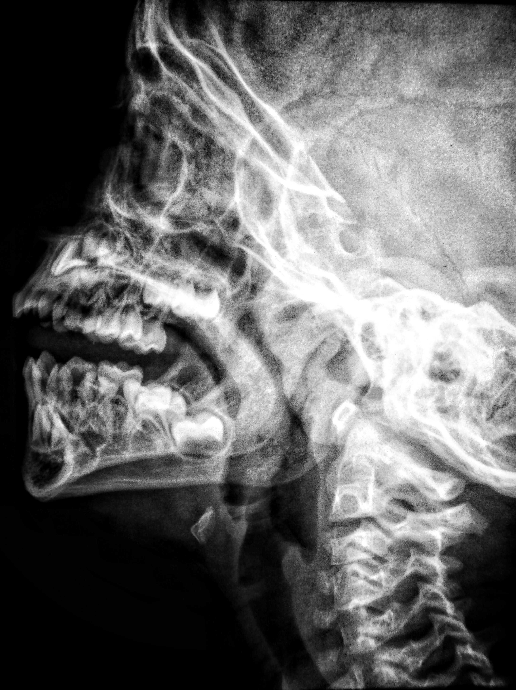
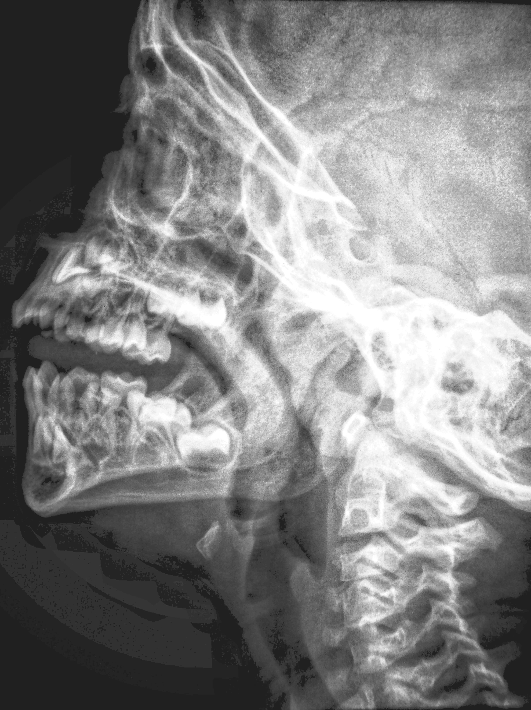
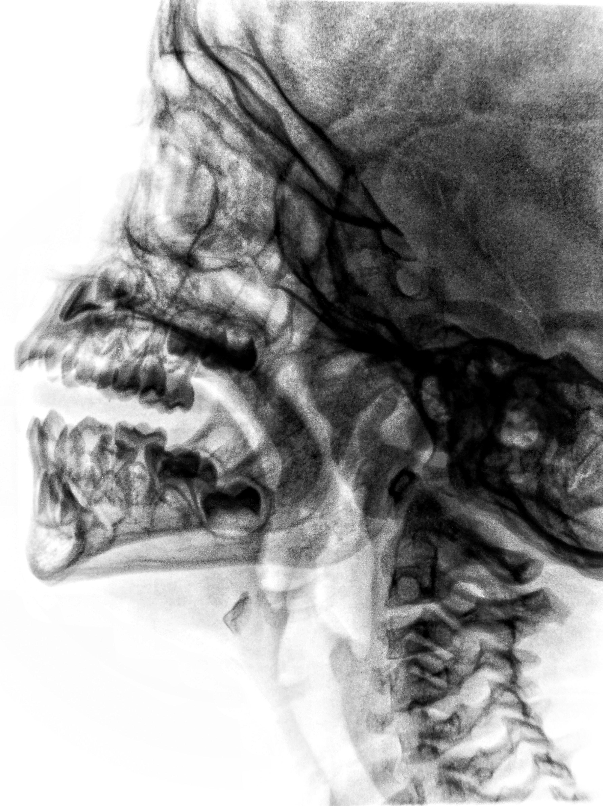
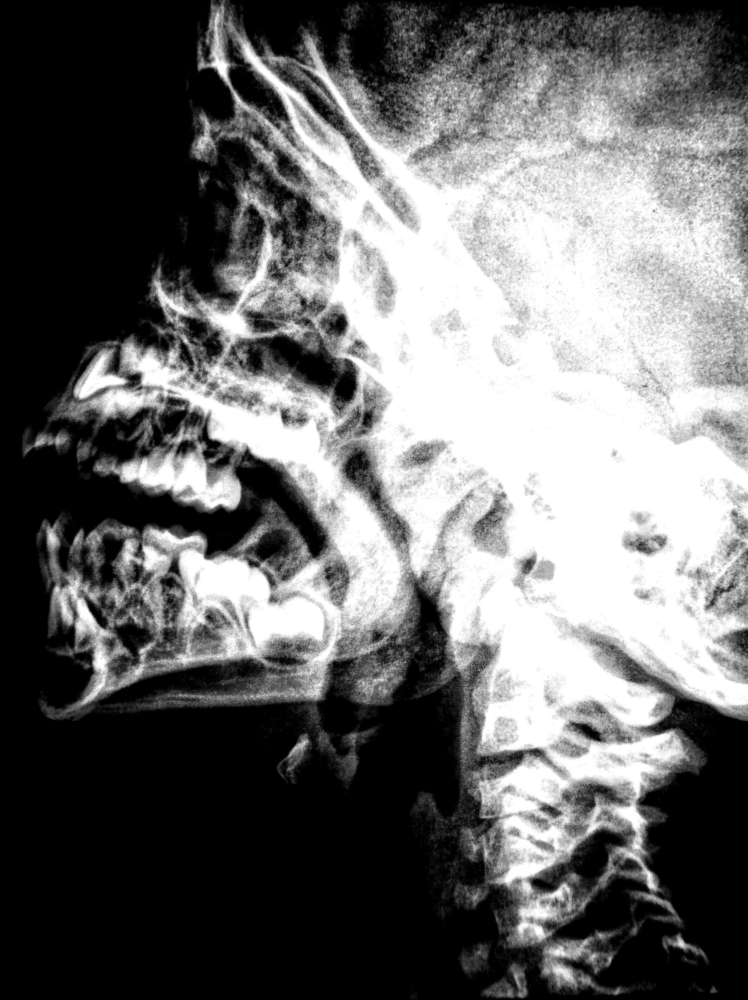

# Tugas 1: Image enhancement in spatial domain

- **Mata Kuliah:** Pengolahan Citra Digital
- **Tanggal:** 21 Februari 2023
- **Anggota Kelompok:**
    1. Luthfiyyah hanifah amari
    2. Selfira Ayu

## Image Enhancement (Perbaikan Citra) dalam domain spatial

### Membaca gambar asli

Gambar asli sebelum diproses:




```matlab
% membaca gambar
I = imread('xray.jpg');
figure('Name', 'Gambar Asli')
imshow(I)
title('X-ray Asli')
```

### Perbaikan dengan Histogram

Memproses gambar menggunakan **histogram** menggunakan fungsi histeq()

```matlab
% HISTOGRAM
% memproses gambar menggunakan histogram
I_hist = histeq(I);
figure('Name', 'Histogram Equalization')
imshow(I_hist)
title('X-ray setelah histogram equalization')
% menyimpan gambar hasil proses histogram
imwrite(I_hist, 'xray_hist.jpg');
```

Hasil gambar setelah diproses dengan histogram:



<div style="display:flex;flex-direction:row;align-items:center;">
  <div style="margin-right:20px;">
    <h2>Original</h2>
    
  </div>
  <div>
    <h2>Histogram</h2>
    
  </div>
</div>


### Perbaikan dengan Proses Negatif

memproses gambar dengan proses negatif

```matlab
% PROSES NEGATIF
% memproses gambar dengan proses negatif
L = 255;
% L adalah nilai tertinggi. dalam hal ini, kita memakai 255 (karena
% grayscale)
I_neg = L - I;
figure('Name', 'Proses negatif')
imshow(I_neg)
% menyimpan gambar hasil proses
imwrite(I_neg, 'xray_neg.jpg');
```

Hasil gambar setelah diproses dengan proses negatif:



### Perbaikan dengan memanfaatkan Clipping

memproses gambar dengan proses clipping. dengan clipping, kita membatasi.

```matlab
% ADJUST: CLIPPING
I_clipped = imadjust(I, [0.2 0.8]);
figure('Name', 'Adjust: CLIPPING')
imshow(I_clipped)
% menyimpan gambar hasil proses
imwrite(I_clipped, 'xray_clip.jpg');
% clipping ke 2 ini sebagai contoh perbandingan
I_clipped2 = imadjust(I, [0.4 0.6]);
figure('Name', 'Adjust: CLIPPING-2')
imshow(I_clipped2)
```

Hasil gambar setelah diproses:




### Code lengkap

```matlab
% membaca gambar
I = imread('xray.jpg');
figure('Name', 'Gambar Asli')
imshow(I)
title('X-ray Asli')

% HISTOGRAM
% memproses gambar menggunakan histogram
I_hist = histeq(I);
figure('Name', 'Histogram Equalization')
imshow(I_hist)
title('X-ray setelah histogram equalization')
% menyimpan gambar hasil proses histogram
imwrite(I_hist, 'xray_hist.jpg');

% PROSES NEGATIF
% memproses gambar dengan proses negatif
L = 255;
% L adalah nilai tertinggi. dalam hal ini, kita memakai 255 (karena
% grayscale)
I_neg = L - I;
figure('Name', 'Proses negatif')
imshow(I_neg)
% menyimpan gambar hasil proses
imwrite(I_neg, 'xray_neg.jpg');

% ADJUST: CLIPPING
I_clipped = imadjust(I, [0.2 0.8]);
figure('Name', 'Adjust: CLIPPING')
imshow(I_clipped)
% menyimpan gambar hasil proses
imwrite(I_clipped, 'xray_clip.jpg');
% clipping ke 2 ini sebagai contoh perbandingan
I_clipped2 = imadjust(I, [0.4 0.6]);
figure('Name', 'Adjust: CLIPPING-2')
imshow(I_clipped2)
```
