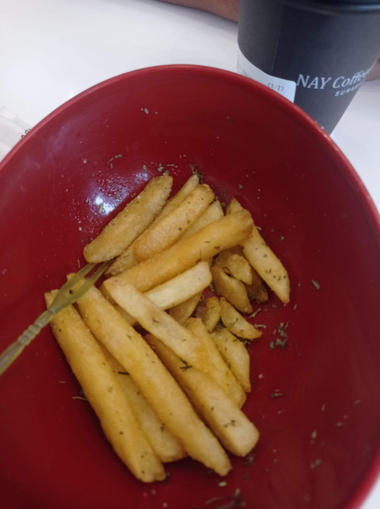
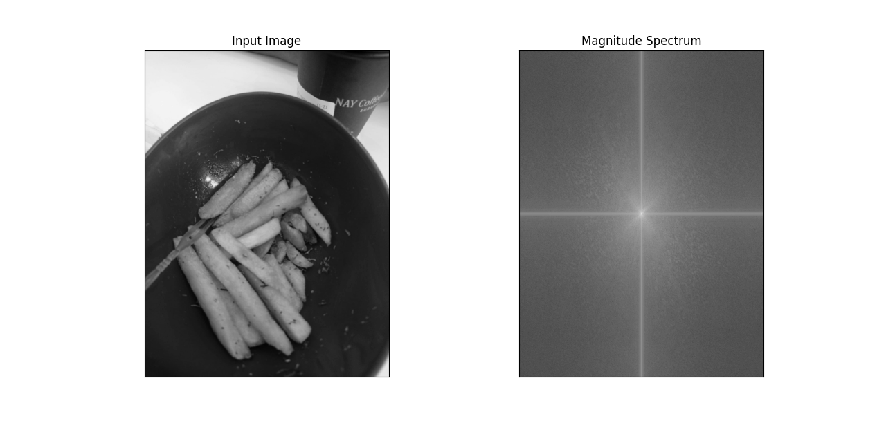
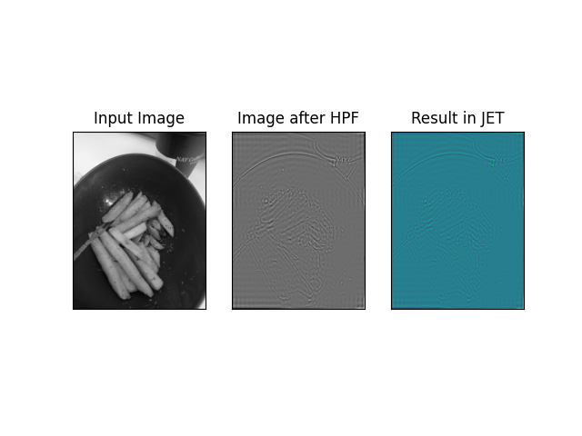
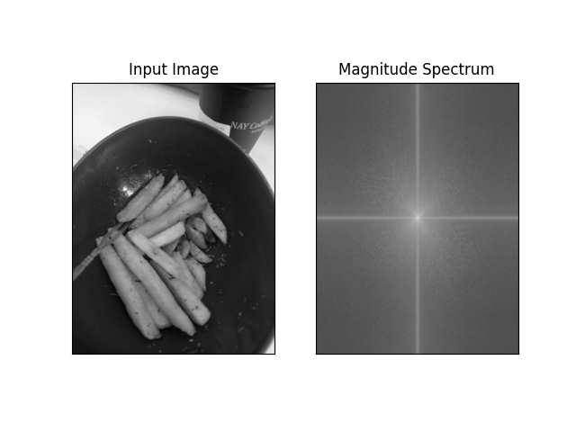
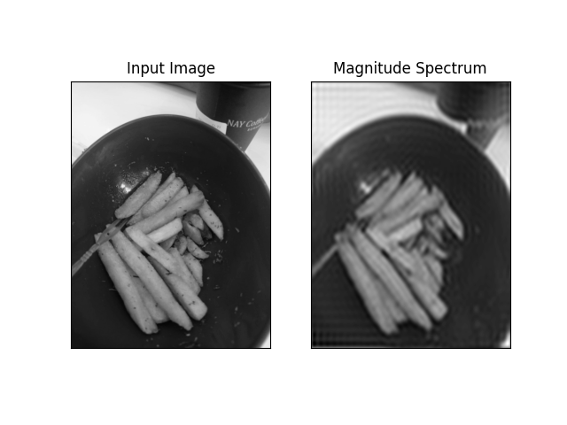

## Identitas Kelompok 
👩‍🎓 
Mata Kuliah: Pengolahan Citra Digital
Dosen Pengampu: Prof.Ir. Handayani Tjandrasa, M.Sc Ph.D
Anggota Kelompok:
Luthfiyyah hanifah amari - 5025201090
Selfira Ayu Sheehan - 5025201174

</aside>

# Gambar original

Pada kali ini, gambar yang digunakan adalah gambar ini



# FFT — Fast Fourier Transform

## Fourier Transform pada Numpy

Kita akan melihat bagaimana menemukan Fourier transform menggunakan Numpy. Numpy memiliki sebuah FFT package  untuk melakukan ini. np.ttf.ttf2() menyediakan kita sebuah transform frequensi yang akan menjadi array kompleks. 

- Argumen pertamanya adalah input image, yang berupa grayscale.
- Argumen kedua itu opsional, yang menentukan ukuran dari array output.
    - jika ini lebih besar dari ukuran input gambar, input gambar diisikan (diempukkan) dengan 0 sebelum perhitungan dari FFT.
    - jika itu kurang dari gambar input, gambar input akan di-crop.
    - jika tidak ada argumen di-pass, output array akan sesuai dengan input array.

sekarang kita dapat hasilnya, frequnsi komponen 0 (DC komponen) akan jadi korner atas kiri. jika kamu ingin membawanya ke tengah, kamu harus menggeser hasilnya dengan N/2 pada kedua arah. ini dengan mudah dilakukan dengan fungsi **np.fft.fftshift()**. (ini lebih mudah untuk dianalisis). sekarang kita menemukan transform frequensinya, kita bisa mendapatkan besar spectrum.

```python
import cv2 as cv
import numpy as np
from matplotlib import pyplot as plt

# read the input image
img = cv.imread('kentang.jpg', cv.IMREAD_GRAYSCALE)
assert img is not None, "file could not be read, check with os.path.exists()"

# Terapkan transformasi fourier
f = np.fft.fft2(img)
fshift = np.fft.fftshift(f)
magnitude_spectrum = 20*np.log(np.abs(fshift))

# visualize the original image and the magnitude spectrum
plt.subplot(121),plt.imshow(img, cmap = 'gray')
plt.title('Input Image'), plt.xticks([]), plt.yticks([])
plt.subplot(122),plt.imshow(magnitude_spectrum, cmap = 'gray')
plt.title('Magnitude Spectrum'), plt.xticks([]), plt.yticks([])
plt.show()
```

Hasilnya:



Kita bisa lebih melihat daerah yang lebih putih di tengah yang menunjukkan menunjukkan frequnsi rendah.

### High-Pass Filter (menggunakan Numpy)
Jadi kita menemukan transform frequensi. Sekarang kita lakukan beberapa operasi di domain frequensi, seperti high pass filtering dan rekontruksi gambar, yaitu menemukan inverse DFT. untuk itu kamu dengan mudah menghilangkan frequensi rendah dengan masking dengan window segi empat dari ukuran 60x60. Lalu, terapkan pergeseran inverse menggunakan np.fft.iffftshift() sehingga komponen DC kembali berada di pojok kiri atas. lalu temukan inverse FFT menggunakan fungsi **np.iffft2()**. Hasilnya, lagi-lagi akan menjadi bilangan kompleks. kita bisa mengambil nilai mutlaknya.

```python
# Terapkan high-pass filter pada spektrum frequensi
rows, cols = img.shape
crow,ccol = rows//2 , cols//2
fshift[crow-30:crow+31, ccol-30:ccol+31] = 0

# Terapkan transformasi balik Fourier pada spektrum frequensi yang telah difilter
f_ishift = np.fft.ifftshift(fshift)
img_back = np.fft.ifft2(f_ishift)
img_back = np.real(img_back)

# visualize the image
plt.subplot(131),plt.imshow(img, cmap = 'gray')
plt.title('Input Image'), plt.xticks([]), plt.yticks([])
plt.subplot(132),plt.imshow(img_back, cmap = 'gray')
plt.title('Image after HPF'), plt.xticks([]), plt.yticks([])
plt.subplot(133),plt.imshow(img_back)
plt.title('Result in JET'), plt.xticks([]), plt.yticks([])
plt.show()
```

Hasilnya:


hasilnya menunjukkan **High Pass filtering merupakan operasi deteksi tepi**. Ini menunjukkan bahwa sebagian besar data gambar hadir di wilayah spektrum frekuensi rendah. Bagaimanapun kita telah melihat bagaimana menemukan DFT, IDFT dll di Numpy. Sekarang mari kita lihat bagaimana melakukannya di OpenCV.

## Fourier Transform pada OpenCV

OpenCV menyediakan fungsi cv.dft() dan cv.idft() untuk ini. itu return hasil yang sama dengan yang sebelumnya, tetapi dengan 2 channel. channel pertama akan mempunyai bagian real dari hasil dan channel kedua akan mempunyai bagian imajiner dari hasil. input image harus di konversikan ke np.float32 terlebih dahulu. kita akan melihat bagaimana melakukannya

```python
import numpy as np
import cv2 as cv
from matplotlib import pyplot as plt

# read the input
img = cv.imread('kentang.jpg', cv.IMREAD_GRAYSCALE)
assert img is not None, "file could not be read, check with os.path.exists()"

# calculating the discrete Fourier transform
dft = cv.dft(np.float32(img),flags = cv.DFT_COMPLEX_OUTPUT)

dft_shift = np.fft.fftshift(dft)
magnitude_spectrum = 20*np.log(cv.magnitude(dft_shift[:,:,0],dft_shift[:,:,1]))

plt.subplot(121),plt.imshow(img, cmap = 'gray')
plt.title('Input Image'), plt.xticks([]), plt.yticks([])
plt.subplot(122),plt.imshow(magnitude_spectrum, cmap = 'gray')
plt.title('Magnitude Spectrum'), plt.xticks([]), plt.yticks([])
plt.show()
```



### Low-pass Filter
Jadi, sekarang kita perlu melakukan inverse DFT. sebelumnya, kita membuat sebuah high pass filter. sekarang kita ingin melihat bagaimana remove konten high frequency pada gambar, yakni kita **menggunakan Low pass filter pada gambar. Ini membuat gambar blur**. Untuk ini, kita membuat sebuah mask terlebih dahulu menggunakan high value (1) pada low frequency (frequensi rendah),yakni kita pass sebuah konten low frequency, dan 0 pada daerah High Frequency.

```python
rows, cols = img.shape
crow,ccol = rows//2 , cols//2 # "//" means floor division

# create a mask first, center square is 1, remaining all zeros
mask = np.zeros((rows,cols,2),np.uint8)
mask[crow-30:crow+30, ccol-30:ccol+30] = 1

# apply mask and inverse DFT
fshift = dft_shift*mask
f_ishift = np.fft.ifftshift(fshift)
img_back = cv.idft(f_ishift)
img_back = cv.magnitude(img_back[:,:,0],img_back[:,:,1])

plt.subplot(121),plt.imshow(img, cmap = 'gray')
plt.title('Input Image'), plt.xticks([]), plt.yticks([])
plt.subplot(122),plt.imshow(img_back, cmap = 'gray')
plt.title('Magnitude Spectrum'), plt.xticks([]), plt.yticks([])
plt.show()
```



# Frequency Domain Filtering on an Image using OpenCV

Pertama kita meng-impor OpenCV library dan Gambar yang akan kita lakukan operasi

```python
import numpy as np
import pandas as pd
import cv2

# Reading the Image
img = cv2.imread("kentang.jpg",cv2.IMREAD_UNCHANGED)
```

Frequency Domain filters itu menggunakan *smoothing* dan *sharpening* (pelembutan dan penajaman) dari gambar dengan pemindahan komponen high atau low-frequency.

Berikut operasi-operasi menggunakan method dari cv2

- Domain filter — memakai cv2.edgePreservingFilter()
    
    ```python
    domainFilter = cv2.edgePreservingFilter(img, flags=1, sigma_s=60, sigma_r=0.6)
    cv2.imshow('Domain Filter',domainFilter)
    cv2.waitKey(0)
    cv2.destroyAllWindows()
    ```
    
    hasil:
    
    

- Gaussian blur (Gaussian smoothing) — memakai cv2.GaussianBlur()
    ```python
    gaussBlur = cv2.GaussianBlur(img,(5,5),cv2.BORDER_DEFAULT)
    cv2.imshow("Gaussian Smoothing",np.hstack((img,gaussBlur)))
    cv2.waitKey(0)
    cv2.destroyAllWindows()
    ```
    hasil:
    

- Mean Filtering Techniques
    
    idenya ialah me-replace setiap nilai pixel pada gambar dengan mean (rata-rata) nilai dari tetangganya, termasuk dirinya sendiri. di sini menggunakan kernel
    
    ```python
    kernel = np.ones((10,10),np.float32)/25
    meanFilter = cv2.filter2D(img,-1,kernel)
    cv2.imshow("Mean Filtered Image",np.hstack((img, meanFilter)))
    cv2.waitKey(0)
    cv2.destroyAllWindows()
    ```
    
    hasil:
    

- Median filtering techniques
    
    proses nonlinear berguna dalam mengurangi impulsif, atau noise salt-and-pepper
    
    ```python
    medianFilter = cv2.medianBlur(img,5)
    cv2.imshow("Median Filter",np.hstack((img, medianFilter)))
    cv2.waitKey(0)
    cv2.destroyAllWindows()
    ```
    
    hasil:
    
    

- Bilateral Filter
    
    Bilateral filter adalah non-linear, edge-preserving (mempertahankan tepi), dan noise reducing smoothing filter untuk gambar
    
    ```python
    print("Bilateral Filter")
    bilFil = cv2.bilateralFilter(img, 60, 60, 60)
    cv2.imshow("Bilateral Filter",np.hstack((img, bilFil)))
    cv2.waitKey(0)
    cv2.destroyAllWindows()
    ```
    
    hasil:
    

- Teknik Frequency Band Filtering - untuk High Band Pass Filter
    
    ```python
    highPass = img - gaussBlur
    # or We can use this statement to filter the high pass image
    #highPass = highPass + 127*np.ones(img.shape, np.uint8)
    cv2.imshow("High Pass",np.hstack((img, highPass)))
    cv2.waitKey(0)
    cv2.destroyAllWindows()
    ```
    
    hasil:
    
    

- Teknik Frequency Band Filtering - untuk Low Band Pass Filter
    
    ```python
    lowPass = cv2.filter2D(img,-1, kernel)
    lowPass = img - lowPass
    cv2.imshow("Low Pass",np.hstack((img, lowPass)))
    cv2.waitKey(0)
    cv2.destroyAllWindows()
    ```
    
    hasil:
    

# Source

[https://docs.opencv.org/3.4/de/dbc/tutorial_py_fourier_transform.html](https://docs.opencv.org/3.4/de/dbc/tutorial_py_fourier_transform.html)

[https://medium.com/@devangdayal/frequency-domain-filtering-on-an-image-using-opencv-26bfcc97e23b](https://medium.com/@devangdayal/frequency-domain-filtering-on-an-image-using-opencv-26bfcc97e23b)
